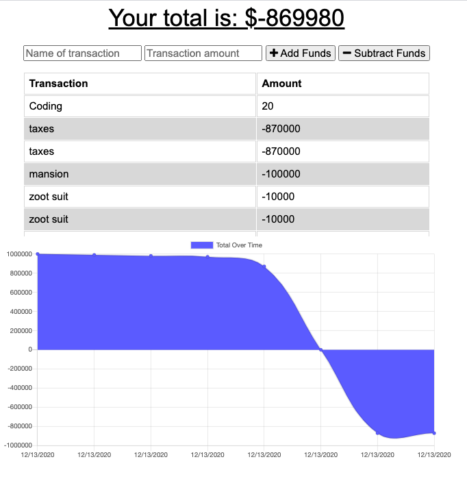

# Budget Tracker Starter Code

## Description 

Budget tracking app that will work offline as well as online and connect 

## Table of Contents 
* [Installation](#installation)
* [Usage](#usage)
* [Credits](#credits)
* [License](#license)

## Installation 
Install the package.json dependencies by typing "npm install" in your terminal. This is after you clone the GitHub repo, and want to test the app in the localhost environment. If so, type "node server" to start the server and go to http://localhost:3001 in your browser to test the app. 

## Usage 
Please visit the following deployed live webpage hosted by Heroku:

https://fathomless-sands-11908.herokuapp.com/

    
## Credits 
UofA Coding Bootcamp starter code. 

## License 
Heroku, Node.js, Express, Service Worker, MongoDB, Mongoose

